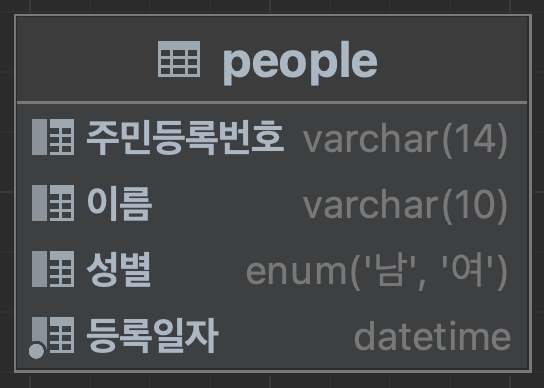
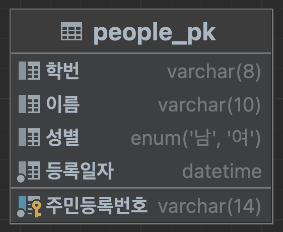
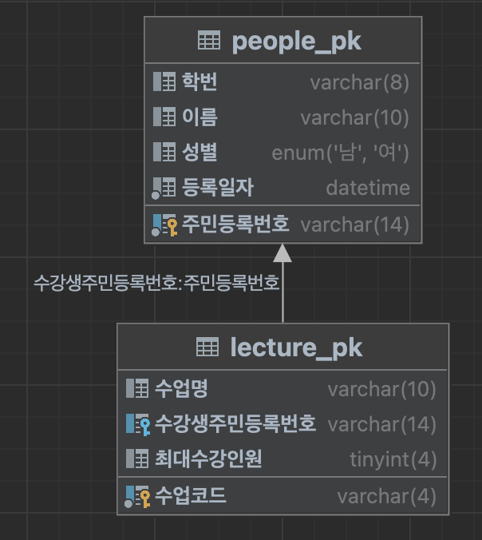

# Database Key

## 0. 들어가기 전에

### 0-1. DB 테이블 용어 정리


Database 에서는

-   `테이블`을 `Relation 관계` 이라고 한다.
-   각각의 `행`은 `Tuple 튜플 / Record 레코드` 라고 한다.
-   각각의 `열`은 `Attribute 속성 / Field 필드` 라고 한다.
-   `행 전체` 는 `Instance 인스턴스` 라고 한다.
-   `열 전체` 는 `Schema 스키마` 라고 한다.
-   `하나의 열에 대한 데이터들`은 `Domain 도메인` 이라고 한다.

## 1. Key 의 정의

> 데이터베이스에서 각각의 `Tuple(튜플)`을 구별할 수 있는 기준이 되는 `Attribute(속성)`이다.

## 2. Key 의 성질

아래는 people 테이블의 속성들을 나타낸 ERD(Entity-Relation Diagram) 이다.

</img>

### 2-1. 유일성

> `하나의 키 값`으로 `튜플을 유일하게 식별`할 수 있는 성질

위의 ERD 에서 주민등록번호를 제외한 다른 속성들은 중복될 수 있다.

따라서 주민등록번호를 키로 지정하게 되면, 주민등록번호는 중복될 수 없으므로 유일성을 만족한다고 할 수 있다.

### 2-2. 최소성

> 속성들 중 `가장 최소로 필요한 속성들로만 키를 구성`하는 성질

위의 ERD 에서 주민등록번호와 이름을 키로 지정할 수도 있다.

물론 이 방식으로도 튜플을 구별할 수 있지만 사실상 주민등록번호 만으로도 구별이 가능하다.

따라서 주민등록번호와 이름을 동시에 키로 지정할 경우, 최소성을 만족하지 않는다고 할 수
있다.

반면, 주민등록번호만을 키로 지정할 경우, 최소성을 만족한다.

## 3. Super Key / Candidate Key

아래는 어느 한 대학의 people 테이블의 속성들을 나타낸 ERD(Entity-Relation Diagram) 이다.

</img>

### 3-1. Super Key (SK)

> `유일성은 만족`하지만, `최소성은 만족하지 않는` 속성 조합의 집합

`학번/주민등록번호 + 다른 속성(이름/성별/나이)`는 유일성을 만족하고, 최소성을 만족하지 않으므로 `SK` 가 될 수 있다.

### 3-2. Candidate Key (CK)

> `유일성`과 `최소성`을 `동시에 만족`하는 속성의 집합

`학번` 과 `주민등록번호`는 유일성과 최소성을 모두 만족하므로 `CK` 가 될 수 있다.

## 4. Primary Key / Alternate Key / Foreign Key

아래는 어느 한 대학의 people 테이블의 속성들을 나타낸 ERD(Entity-Relation Diagram) 이다.

</img>

### 4-1. Primary Key (PK)

> `CK 가 될 수 있는 속성들` 중에서 `하나를 선택`한 키

위의 people_pk 테이블에서는 학번과 주민등록번호가 CK 가 될 수 있고,

그 중에서 `주민등록번호`를 `PK` 로 지정했다.

### 4-2. Alternate Key (AK)

> `PK 로 지정되지 못한 CK` 들의 집합

위의 people_pk 테이블에서는 학번과 주민등록번호가 CK 가 될 수 있고,

주민등록번호를 PK 로 지정했으므로 `PK 로 지정되지 못한 학번`이 `AK` 가 된다.

### 4-3. Foreign Key (FK)

> `다른 릴레이션의 PK 를 참조`하고 있는 키

</img>

위 그림은 people_pk 와 lecture_pk 의 관계(1:N)를 나타내는 ERD 이다.

수강생주민등록번호를 주민등록번호(PK)의 FK 로 지정했다.

## 5. 참고. 테이블 생성 코드

```sql
-- people 테이블 생성
create table people (
    주민등록번호 varchar(14),
    이름 varchar(10),
    성별 enum('남', '여'),
    등록일자 DATETIME not null
);

-- people_pk 테이블 생성 + pk 지정
create table people_pk (
    주민등록번호 varchar(14),
    이름 varchar(10),
    성별 enum('남', '여'),
    등록일자 DATETIME not null,
    constraint PK_person primary key (주민등록번호)
);

-- 테이블에 속성 추가
alter table people_pk add 학번 varchar(8);
alter table people add 학번 varchar(8);

-- 속성 순서 변경
alter table people modify column 학번 varchar(8) after 주민등록번호;
alter table people_pk modify column 학번 varchar(8) after 주민등록번호;

-- lecture_pk 테이블 생성 + fk 지정
create table lecture_pk (
    수업코드 varchar(4) primary key ,
    수업명 varchar(10),
    수강생주민등록번호 varchar(14),
    최대수강인원 tinyint,
    foreign key (수강생주민등록번호) references people_pk (주민등록번호)
);

-- pk 가 아닌 속성에 대해 fk 를 지정하려고 하니까
-- Error : "Foreign key constraint is incorrectly formed"
create table lecture_pk (
    수업코드 varchar(4) primary key ,
    수업명 varchar(10),
    수강학생학번 varchar(8),
    최대수강인원 tinyint,
    foreign key (수강학생학번) references people_pk (학번)
);
```
