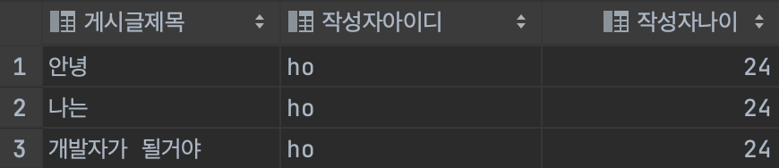
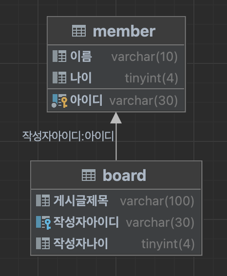
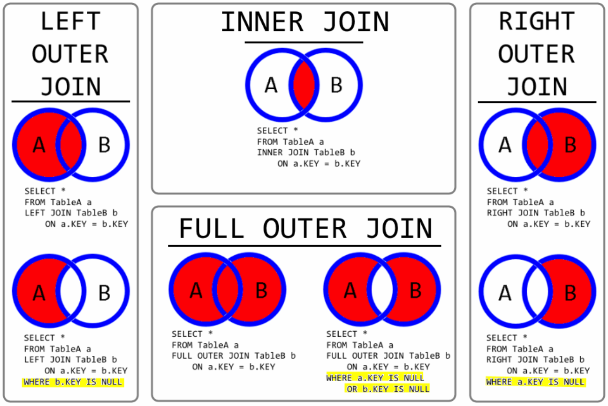

# Join

> 2개 이상의 테이블을 결합해 검색하는 방법

## 0. 들어가기 전에

왜 굳이 하나의 테이블이 아닌 여러 개의 테이블에 데이터를 분리시키고, Join 이라는 방법으로 검색을 할까?

이유는 결국 `관리의 편의성` 때문이다.

예를 들어, 게시판에 대한 테이블이 있다고 하자.



만약 작성자나이가 바뀐다면 어떻게 될까?

작성자의 나이를 3번 바꿔줘야 될 것이다.

하지만 게시판 테이블과 회원 테이블을 분리해두면 훨씬 문제가 간단해진다.



위와 같이 게시판테이블과 회원테이블을 분리 후 join 으로 이어준다.

그러면 아래의 회원테이블에서 아이디가 `ho` 인 회원의 나이를 업데이트하면,

게시판의 작성자아이디가 `ho` 인 회원의 나이도 한번에 바꿀 수 있다.


자세한 방법과 원리는 아래에서 천천히 살펴보자.

## Join 의 종류



Join 은 쉽게 말해 집합이라고 생각하면 되고, 크게 4가지로 나뉜다.

-   Left (Outer) Join
-   Right (Outer) Join
-   Inner Join
-   Full (Outer) Join

## join 쿼리문 작성 (MySQL)

> join 을 이용한 데이터 조회하기

```sql
select * from [왼쪽 테이블] as left [left join / right join] [오른쪽 테이블] as right on [조건]
```

### Left (Outer) Join & Right (Outer) Join

```sql
select * from board as b LEFT JOIN member as m on b.작성자나이 = m.나이;
select * from member as m right JOIN board as b on b.작성자나이 = m.나이;

select * from board as b right JOIN member as m on b.작성자나이 = m.나이;
select * from member as m LEFT JOIN board as b on b.작성자나이 = m.나이;
```

### Inner Join

```sql
select * from board as b inner JOIN member as m on m.나이 = b.작성자나이;
select * from board as b inner JOIN member as m on m.나이 = b.작성자나이;
```

### Full (Outer) Join

```sql
select * from board as b left join member as m on b.작성자아이디 = m.아이디
union
select * from board as b right join member as m on b.작성자아이디 = m.아이디;
```
