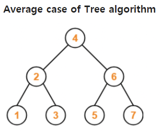
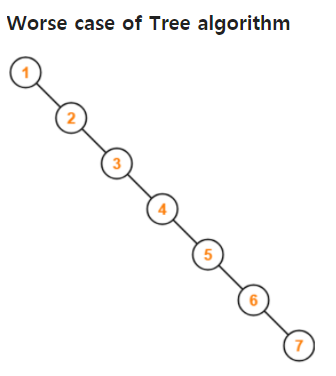
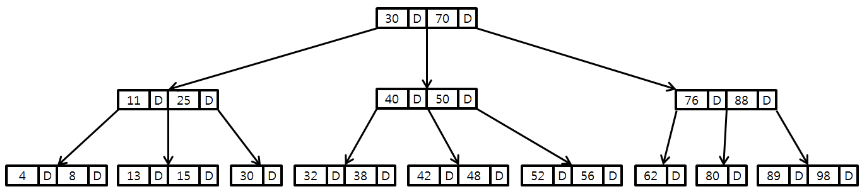
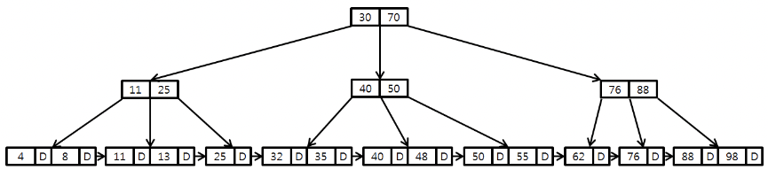

# 인덱스 Index

## 인덱스란?

> `B-Tree` 자료구조를 이용해 `데이터 저장, 수정, 삭제에 대한 성능을 희생`시켜 `탐색에 대한 성능을 대폭 상승`시키는 방식

### Tree 와 B-Tree



Tree 는 평균적으로 탐색에 대한 시간 복잡도가 logN 이지만, 최악의 케이스를 고려한다면 시간 복잡도가 O(N) 이다.

이러한 경우를 방지하기 위해 밸런스 트리(Balanced Tree) 를 이용한다.

**🔎 밸런스 트리(Balanced Tree)란?**



```
트리의 노드가 한 방향으로 쏠리지 않도록,
노드 삽입 및 삭제 시 특정 규칙에 맞게 재정렬되어
왼쪽과 오른쪽 자식 양쪽 수의 밸런스를 유지하는 트리이다.

항상 양쪽 자식의 밸런스를 유지하므로,
무조건 O(logN)의 시간 복잡도를 가지게 된다.

하지만 노드 삽입 및 삭제 시 발생하는 재정렬 작업 때문에
탐색을 제외한 작업에서는 일반 Tree보다 성능이 좋지 않다.
```

## 인덱스와 자료구조

### 해시 테이블을 사용 못하는 이유

사실 탐색 시간이 빠른 것으로 인덱스 자료 구조를 선택한다면,

시간복잡도가 O(logN)인 다른 자료 구조를 사용하거나 시간복잡도가 O(1)인 해시 테이블을 사용하는 것이 더 빠를 수 있다.

**해시 테이블**

keys - hash funcion - hash table

로 이뤄진 해시 테이블은 key 의 값이 1이라도 달라지면 새로운 해시 값을 생성하므로 부등호 연산이 자주 사용되는 DB 검색에 적합하지 않다.

### B-Tree 가 선택한 이유



B-Tree 는 하나의 노드에 여러 데이터가 저장될 수 있다.

-   각 노드 데이터들은 항상 정렬된 상태이다.
-   데이터 사이의 범위를 사용해 자식 노드를 가진다.
-   같은 노드 상에서 데이터를 탐색할 때, 포인터가 아니라 실제 메모리를 통해 다음 인덱스로 접근할 수 있다.
-   데이터 탐색, 저장, 수정, 삭제 모두 O(logN) 의 시간 복잡도를 갖는다.

### B+Tree 가 선택한 이유



B-Tree는 어느 한 데이터의 검색은 효율적이지만, 모든 데이터를 한 번 순회하는 데에는 트리의 모든 노드를 방문해야 하므로 비효율적이다.

이러한 B-Tree의 단점을 개선시킨 자료구조가 B+Tree이다.
