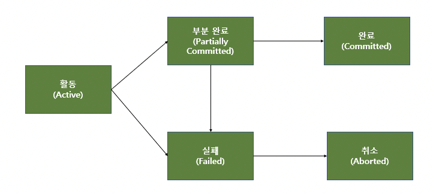

# 트랜잭션

## 트랜잭션이란?

> 트랜잭션은 데이터베이스의 한번에 수행돼야할 일련의 연산들(CRUD)의 집합으로 작업의 단위이다.

트랜잭션은 연산을 수행해 DB 의 상태를 변화시키는 작업의 단위이다.

트랜잭션은 작업의 완전성을 보장한다.

즉, 논리적인 작업 세트를 완벽하게 처리하지 못할 경우

작업 전의 상태를 복구해 작업의 일부만 적용되는 현상을 막아준다.

## 트랜잭션의 특징

-   원자성 Atomicity
    -   트랜잭션이 DB 에 모두 반영되거나, 전혀 반영되지 않아야 한다.
-   일관성 Consistency
    -   트랜잭션의 작업 처리 결과가 일관성이 있어야 한다.
-   독립성 Isolation
    -   둘 이상의 트랜잭션이 동시에 실행될 경우, 다른 트랜잭션의 연산에 끼어들 수 없다.
-   지속성 Durability
    -   트랜잭션이 성공적으로 완료될 경우, 결과는 영구적으로 반영된다.

## Commit 과 Rollback

### Commit

Commit 연산은 하나의 트랜잭션이 성공적으로 끝났고 DB 가 일관성있는 상태에 있을 때,

하나의 트랜잭션이 끝났음을 알려주기 위해 사용하는 연산이다.

### Rollback

Rollback 연산은 하나의 트랜잭션 처리가 비정상적으로 종료돼 DB 의 일관성을 깼을 때,

이 트랜잭션의 일부가 정상적으로 처리돼도 모든 연산을 취소하는 연산이다.

## 트랜잭션 상태

-   활동 : 트랜잭션이 실행중이다.
-   부분완료 : sql 문이 수행되고 commit 만 남은 상태이다.
-   완료 : commit 이 완료돼 트랜잭션이 정상적으로 완료된 상태이다.
-   실패 : 트랜잭션이 정상적으로 진행될 수 없는 상태이다.
-   취소 : 트랜잭션이 취소되고 트랜잭션 실행 전의 데이터로 돌아간 상태이다.

## 트랜잭션 사용 시 주의사항

> 트랜잭션의 범위를 최소화하자.

트랜잭션은 꼭 필요한 최소의 코드에만 적용하는 것이 좋다.

일반적으로 DB 커넥션 수는 제한적인데,

각각의 단위 프로그램이 커넥션을 소유하는 시간이 길어지면 여유 커넥션의 수가 줄어든다.

나중에는 각 단위 프로그램이 커넥션을 가져가기 위해 기다려야 하는 상황이 생길 수 있다.
