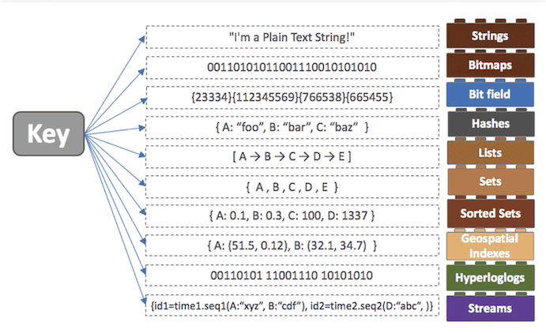

# Redis (Remote Dictionary Server)

## Redis 란

> 메모리 기반의 key-value 구조 데이터 관리 시스템으로 쿼리 없이 Key 를 통해 데이터를 가져올 수 있다.

-   NoSql 의 한 종류 / Memcached 의 한 종류
-   자바 자료구조와 유사한 영속적인 자료구조 제공
-   String, Set, SortedSet, Hash, List 등의 데이터 형식 지원
-   서버 복제 지원 -> 읽기 성능 증가
-   클라이언트 Sharding 지원 -> 쓰기 성능 증가

## Redis 의 장점

-   여러 데이터 형식을 지원한다.
-   List 데이터 입력 및 삭제가 MySQL 에 비해 10배 정도 빠르다.
-   영속적인 데이터 보존이 가능하다.

## Redis 의 영속성

Redis 는 영속성을 보장하기 위해 데이터를 디스크에 저장할 수 있다.

서버가 내려가더라도 디스크에 저장된 데이터를 읽어 메모리에 로딩한다.

디스크에 저장하는 방식은 크게 2가지가 있다.

-   RDB (Snapshotting)
    -   메모리에 있는 내용 전체를 디스크에 옮겨담는 방식
-   AOF (Append On file)
    -   Redis 의 모든 write/update 연산 자체를 모두 log 파일에 기록하는 방식

## Redis 컬렉션

위에서 언급했듯이 Redis 는 key-Value 구조 뿐만 아니라 다양한 데이터 형식을 지원한다.

이를 컬렉션이라고 부르며, 종류는 아래와 같다.

